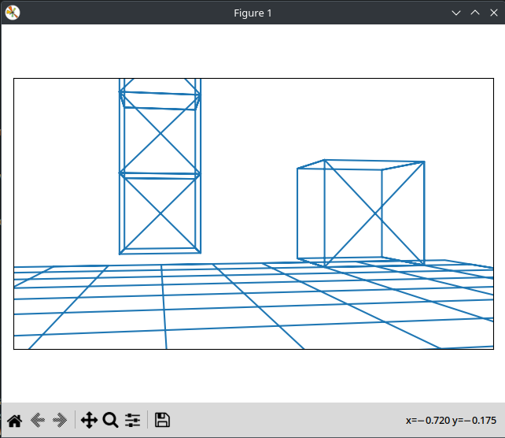

# Matplotlib 3D Graphics Project

This project provides a simple interactive 3D graphics program using Python 3. The program displays a world with cubes and a first-person camera that can be rotated and moved around in a 3D space.

## Requirements

To run the program, you need to have the following libraries installed:

- numpy
- matplotlib
- transformers

## Usage

To start the program, simply run the `main.py` file using Python 3. Once the program starts, you will be prompted with a set of instructions on how to use it.

The world can be moved and rotated using the following keys:

- `w`: move forward
- `s`: move backward
- `a`: move left
- `d`: move right
- `q`: turn left
- `e`: turn right
- `r`: look up
- `f`: look down

To exit the program, press `CTRL+C` or press the X button on the window.

## Notes

- Sometimes points are behind the camera and are not visible. This causes an issue where the lines connecting the points are either not drawn or are drawn incorrectly. This is a known issue.
- The display window is set to a fixed aspect ratio of 16:9 and a fixed height of 1 unit. The width of the display can be adjusted by changing the `SCREEN_X_SIZE` variable in the code.
- The world is defined in the `load_world.py` file. You can modify this file to define a different 3D object to display.
